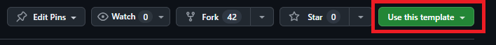
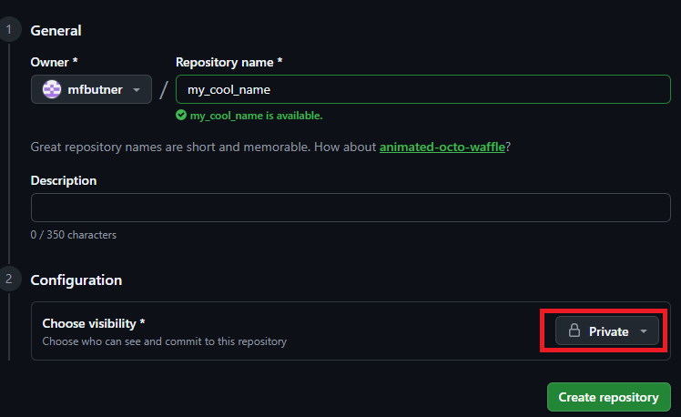
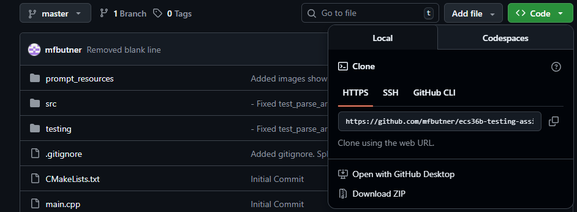
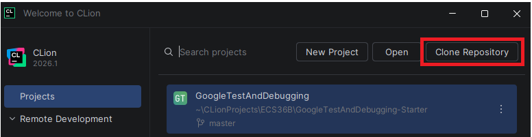
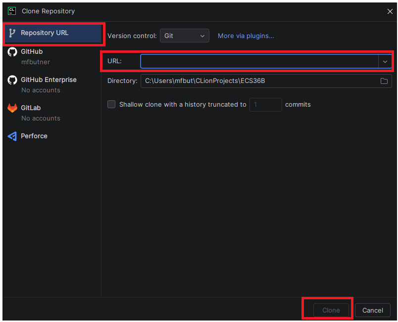
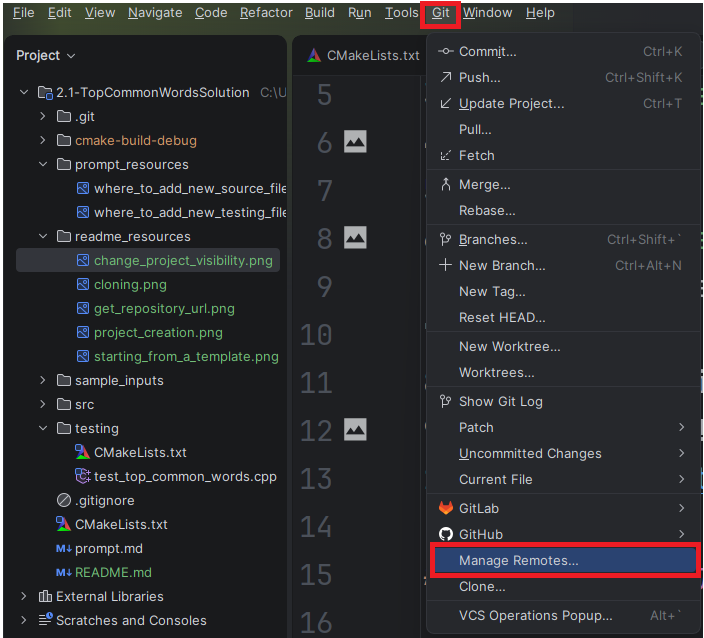

# How To Get A Copy Of This Assignment

1. Select
   `Use This Template -> Create a new repository` 
2. Name your repository and make sure to set the visibility to **Private** 
    - Leave `Include All Branches` as `Off`
3. Click `Create Repository`
4. Copy the url of GitHub repo you just created 
5. Open Clion
6. Select `Clone Project` 
    - If you already have a project opened, instead select  `New -> Project From Version Control`
7. Paste it in
8. Choose the directory where the project will be saved on your computer
9. Click Clone 
10. Read [prompt.md](prompt.md) to start the project

## Linking Your Repo To The Starter Code

Occasionally I may need to make changes to the initial starter code. To be able to
pull those changes into your project in the future

1. Go back to the link to the **original starter code** (the original not the repository
   you created from the template)
2. Copy the url of the **starter** code
3. In your Clion Project select `Git | Manage Remotes` 
4. Click the `+` button
5. Under `URL` paste the url you copied in step 3
6. Under name enter `template_starter`

## Getting Updates To Changes Made To Starter Code

To get any changes made to the starter code, do the following

1. In CLion, click `Git | Fetch`
2. Switch to the branch you want to merge the changes into
3. Open a terminal
4. `cd` into your repository if you are not already there
5. Enter the command
   `git merge template_starter/master --allow-unrelated-histories -m "Getting updates to starter code"`
6. Resolve any merge conflicts that may arise

