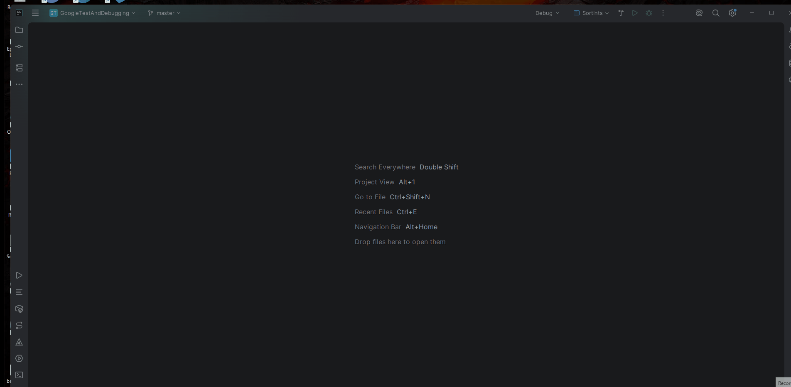

# Google Test and Debugging

## Goals

- Become comfortable using Google Test to write test cases
- Become comfortable using Rapid Check to write property based test cases
- Become comfortable using the debugger to locate and resolve errors in a program

## Matthew's Stats

- Time Taken: 40 minutes

## Please Use the Starter Code

- It's there!
- It has the right format!
- The CmakeList.txt files are already set up for you
- You need to use it to do the problem!

So please make sure to use the **starter code**.

## Problem

You are given a project that is supposed to accept integers on the command line,
sort them, and then print out the sorted result. Unfortunately, the programmer that
implemented the project

- Didn't finish writing the test cases
- Made some mistakes in their solution 😢

It is now up to you to

- Write test cases
- Find, document, and fix their mistakes.

### Part 1 - Understand The Algorithm

The programmer was trying to implement the following sorting algorithm

For each position in the array, `i`

1. Locate the position of the smallest item in the array at an index greater than or equal to `i`.
    - Call this position `index_of_min_item`
2. Swap the elements at position `i` and `index_of_min_item`

#### An Example Of The Algorithm

Let's say we were given the following values: [12, 45, 10, 8, 13]

##### Iteration 0

| Index | 0  | 1  | 2  | 3 | 4  |
|-------|----|----|----|---|----|
| Value | 12 | 45 | 10 | 8 | 13 |

1. i = 0 so we find the minimum value at index >= 0.
2. This is 8, located at index 3.
3. Swap what is at index 0 and index 3.

| Index | 0 | 1  | 2  | 3  | 4  |
|-------|---|----|----|----|----|
| Value | 8 | 45 | 10 | 12 | 13 |

##### Iteration 1

| Index | 0 | 1  | 2  | 3  | 4  |
|-------|---|----|----|----|----|
| Value | 8 | 45 | 10 | 12 | 13 |

1. i = 1 so we find the minimum value at index >= 1
2. This is 10, located at index 2.
3. Swap what is at index 1 and index 2.

| Index | 0 | 1  | 2  | 3  | 4  |
|-------|---|----|----|----|----|
| Value | 8 | 10 | 45 | 12 | 13 |

##### Iteration 2

| Index | 0 | 1  | 2  | 3  | 4  |
|-------|---|----|----|----|----|
| Value | 8 | 10 | 45 | 12 | 13 |

1. i = 2 so we find the minimum value at index >= 2
2. This is 12, located at index 3.
3. Swap what is at index 2 and index 3.

| Index | 0 | 1  | 2  | 3  | 4  |
|-------|---|----|----|----|----|
| Value | 8 | 10 | 12 | 45 | 13 |

##### Iteration 3

| Index | 0 | 1  | 2  | 3  | 4  |
|-------|---|----|----|----|----|
| Value | 8 | 10 | 12 | 45 | 13 |

1. i = 3 so we find the minimum value at index >= 3
2. This is 13, located at index 4.
3. Swap what is at index 3 and index 4.

| Index | 0 | 1  | 2  | 3  | 4  |
|-------|---|----|----|----|----|
| Value | 8 | 10 | 12 | 13 | 45 |

##### Iteration 4

| Index | 0 | 1  | 2  | 3  | 4  |
|-------|---|----|----|----|----|
| Value | 8 | 10 | 12 | 13 | 45 |

1. i = 43 so we find the minimum value at index >= 4
2. This is 45, located at index 4. 
3. Swap what is at index 4 and index 4.

| Index | 0 | 1  | 2  | 3  | 4  |
|-------|---|----|----|----|----|
| Value | 8 | 10 | 12 | 13 | 45 |

##### Completion

At this point, we are done and the values are sorted

### Part 2 - Write Test Cases

Write test cases to test the methods found in sortting.cpp and formatting.cpp except for
print_ar. We can't write test cases for print_ar because it prints to the screen and we can't
check that in Google Test. We also aren't writing test cases for main because
main is the main function. 

Just because we are not writing test cases for those methods,
**It does not mean that these functions are error-free.** 😉😉

Each function has comments saying what it is supposed to do. 
The test cases you write should be based on the intended
behavior described in the comments.

The test cases you must write are the testing folder. 
**BEFORE** you look at the test cases, read the descriptions of the
functions in `src` and consider what test cases you would write to verify their correctness.

Make a list of the things you would want to test for and
then compare them against the test cases you find. 
- Are there ones that you thought of that I didn't? 
- Are the ones that I thought of that you didn't consider?

**INCLUDE YOUR LIST OF THINGS YOU WANT TO TEST IN YOUR [WRITEUP](#Writeup)!** 

You **CAN** and are encouraged to use C++ code in writing the test cases,
but it is not required. 

#### Simple vs. Property Tests

There are two "types" of tests in you will be writing: simple and property tests. In
the simple tests, you only need to generate one explict input and then see if the code
under test does the right thing. In property tests, you will use 
[Rapid Check Generators](https://github.com/emil-e/rapidcheck/blob/master/doc/generators_ref.md)
to generate the inputs and then use those in the tests. Because of this structure,
many of the tests are repeated as both simple and property tests, however for some simple tests,
they can be condensed into a single property test.

#### Recommended Test Writing Order

1. `swap`
2. `copy_array`
3. `min_index_of_array`
4. `make_sorted`
5. `get_sorted`
6. `parse_args`

I also recommend doing the simple tests before the property based tests.

#### Test Helpers

There are a few things that you made find yourself repeatedly doing. If that's the case,
you should probably write a function that you can call repeatedly instead of copying the 
code repeatedly. You can put those functions in `test_helpers.cpp` and their declarations in
`test_helpers.h`

I've left you two functions in there already: `copy_vector_to_array` and `elements_in_vector_and_array_are_same`
as the C code under test wants C arrays, but it is much easier to use Rapid Check to generate `vector`s.


### Part 3 - Fix the Program

Use your test cases along with the debugger to fix the program.

#### Restrictions
- You may only use C code when fixing the code in the `src` folder. No C++!
  - You must preserve the spirit of the given solution: 
  1. Parse the command line arguments
  2. Sort the numbers using the algorithm presented
  3. Print the results.

- You may **NOT** change any of the functions' signatures except for the types of the parameters.
- May **NOT** use the standard libraries sorted, min, and max functions in your solution. 
  Doing so will be considered **cheating for this assignment and
  we will send you to SJA if you do.**
- May not use a different algorithm than the one covered in Part 1 to solve the problem

## CLion Specifics

### Setting Command Line Arguments
Command line arguments can be set by 
1. Going to the configuration you want to add command line arguments to
2. Clicking  `...` next to the configuration
3. Selecting `Edit...`
4. Entering your command line arguments in `Program Arguments`


### Switching Between Run Configurations
1. Click on the Drop-Down Arrow next to the current configuration
2. Click `All Configurations` if the configuration you want isn't the current one
3. Select the configuration you want
   - For this homework, you will be interested in the `SortInts` and `SortingTesting` configurations 




## Compiling on the Terminal (Optional)

Here are the steps if you want to compile and run the project on the terminal instead of
in CLion. You will still need `cmake` to do this.

1. `cd` into the directory where the `TestingAndDebugging` folder is at 
   (not `TestingAndDebugging` itself but the folder that has `TestingAndDebugging` in it)
2. Make a new directory called build: `mkdir build`
3. `cd` into build
4. Run `cmake ../TestingAndDebugging`
   - This step only has to be done the first time and any time you change what is in a CMakeLists.txt
5. `cmake --build .`
   - This command will compile your project. 
   - It needs to be run the first time and any time you change what
   is in a CMakeLists.txt, .c, .cpp, or .h file. After you do this
     - `SortInts` (the program) will be in `build/src/SortInts`
     - `SortingTesting` (the Google test executable) will be in `build/testing/SortingTesting`

## Examples

Below are two examples of how your finished program will be run and 
what the expected output is.

### Example 1

`./SortInts 25 83 17 24`

```terminaloutput
The numbers you entered are: 25 83 17 24
After sorting the numbers we have: 17 24 25 83
```

### Example 2

`./SortInts 5 5 6 3`

```terminaloutput
The numbers you entered are: 5 5 6 3 
After sorting the numbers we have: 3 5 5 6
```

## Writeup

In addition to writing the tests and getting fixing your code,
you will also need to fill out `writeup.md` with
1. A list of the things that you thought to test **BEFORE** you looked
at the actual test cases
2. For **three** of the bugs you find
   1. It's location in the code
   2. A copy of the buggy code
   3. A description of what was wrong with it
   4. An explanation of how you fixed it
   5. A copy of the fixed code

`writeup.md` has already been set up with the correct format for you to fill in.

If you've never used markdown before please look at https://www.markdownguide.org/basic-syntax/
for a rundown of the syntax. 


## What To Submit

Submit a fork of this project hosted on GitHub with
1. The tests implemented
2. The code fixed
3. `writeup.md` filled out

to GradeScope